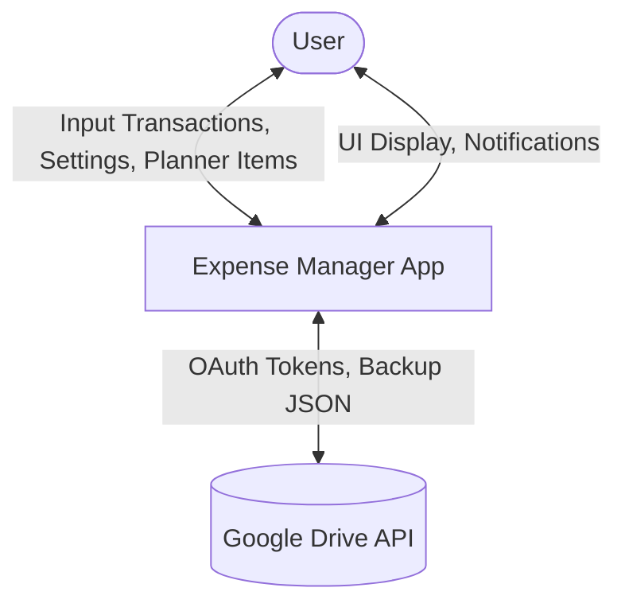
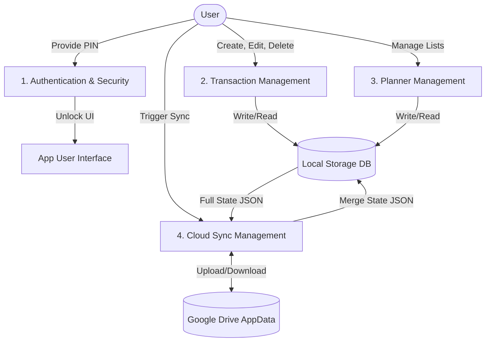

# Data Flow Diagrams (DFD)

## Level 0 Context Diagram

## Level 1 Data Flow Diagram

## Explanation of Data Stores
- **Local Storage DB:** The primary source of truth for the current device. It operates 100% offline.
- **Google Drive AppData:** A hidden cloud container specific to the user's Google Account. Used as a remote backup and sync bridge between multiple devices.
